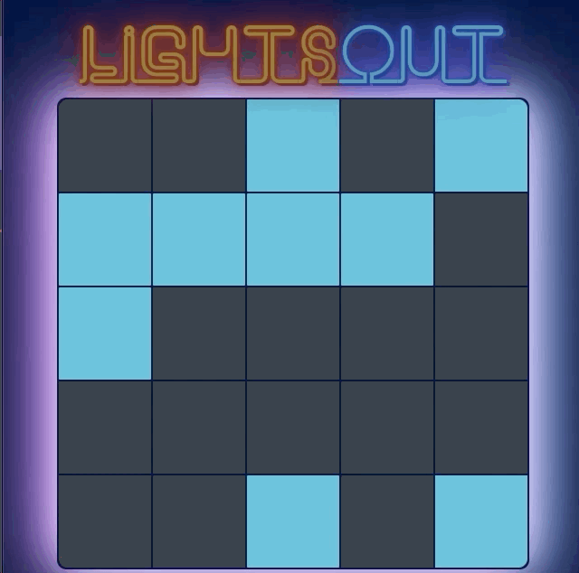

This project provides a chance to work with React events where the state and events happen in different classes.

Lights Out is a logic/puzzle game, played on a grid of individual lights, which can either be lit or unlit. 
The puzzle is won when when all of the lights are turned off.

You can click on a cell to toggle that light — but it also toggles the light above it, to the left of it, to the right of it, and below it. (Cells on an edge or in the corner won’t flip as many lights, since they are missing some neighbors).

